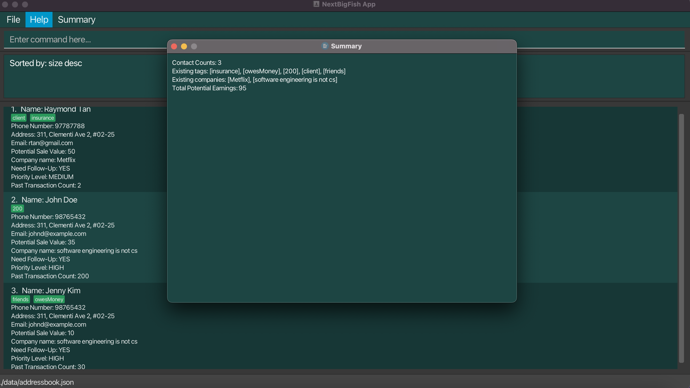

NextBigFish (NBF) is a
**desktop app tailored for the needs of sales-people, supporting the management of contacts, leads or clients ** 
and optimized for use via a Command Line Interface** (CLI) while still having the benefits of a Graphical User Interface (GUI). 
If you can type fast, NBF can get your client and lead management tasks done faster than traditional GUI apps.
NBF allows client contacts to hold data on their potential business size and counts of past transactions and aids users in categorising them using `tag`s
On top of that, NBF also provides a summary page to allow users to quickly get an overview of their performance each season, detailing relevant statistics.

 Viewing help : `help`
=======
* Table of Contents

--------------------------------------------------------------------------------------------------------------------

## Quick start

1. Ensure you have Java `11` or above installed in your Computer.

1. Download the latest `nextbigfish.jar` from [here](https://github.com/AY2223S2-CS2103-F10-4/tp/releases/).

1. Copy the file to the folder you want to use as the _home folder_ for your nextbigfish.

1. Open a command terminal, `cd` into the folder you put the jar file in, and use the `java -jar nextbigfish.jar` command to run the application. 
   A GUI similar to the below should appear in a few seconds. Note how the app contains some sample data. 
   

1. Type the command in the command box and press Enter to execute it. e.g. typing **`help`** and pressing Enter will open the help window. 
   Some example commands you can try:

   * `list` : Lists all contacts.

   * `add n/John Doe p/98765432 e/johnd@example.com a/311, Clementi Ave 2, #02-25 s/500 c/Bacefook pr/HIGH tr/25 t/friends t/owesMoney` : Adds a contact named `John Doe` to the Address Book.

   * `delete 3` : Deletes the 3rd contact shown in the current list.

   * `clear` : Deletes all contacts.

   * `exit` : Exits the app.

1. Refer to the [Features](#features) below for details of each available command.

--------------------------------------------------------------------------------------------------------------------

## Features

**Notes about the command format**

* Words in `UPPER_CASE` are the parameters to be supplied by the user. 
  e.g. in `add n/NAME`, `NAME` is a parameter which can be used as `add n/John Doe`.

* Items in square brackets are optional. 
  e.g `n/NAME [t/TAG]` can be used as `n/John Doe t/friend` or as `n/John Doe`.

* Items with `…` after them can be used multiple times including zero times. 
  e.g. `[t/TAG]…` can be used as ` ` (i.e. 0 times), `t/friend`, `t/friend t/family` etc.

* Parameters can be in any order. 
  e.g. if the command specifies `n/NAME p/PHONE_NUMBER`, `p/PHONE_NUMBER n/NAME` is also acceptable.

* If a parameter is expected only once in the command but you specified it multiple times, only the last occurrence of the parameter will be taken. 
  e.g. if you specify `p/12341234 p/56785678`, only `p/56785678` will be taken.

* Extraneous parameters for commands that do not take in parameters (such as `help`, `list`, `exit` and `clear`) will be ignored. 
  e.g. if the command specifies `help 123`, it will be interpreted as `help`.

### Viewing help : `help`

Brings users to the help page.

Format: `help`

### Adding a person: `add`

Adds a person to the address book.

Format: `add n/NAME p/PHONE_NUMBER e/EMAIL a/ADDRESS s/Potential Earning c/COMPANY_NAME pr/PRIORITY tr/TRANSACTION_COUNT [t/TAG]`

- Name `n/`: Refers to the name of the specified person. (Duplicates are not allowed)
- Phone Number `p/`: The mobile phone number of the specified person (Must be a minimum of 3 digits)
- Email `e/`: The email of the specified person. (Must be a valid email with a domain)
- Address `a/`: The full address of the specified person.
- Potential Sale Value `s/`: The expected value of revenue to be brought in by the client.
- Company Name `c/`: Name of the specified person's company. For convenience, users are recommended to use a short form with only alphanumeric characters. (Put 'NIL' if not applicable)
- Priority `pr/`: How much this client should be prioritized. (Must be one of [`HIGH`, `MEDIUM`, `LOW`])
- Transaction Count `tr/`: The number of previous transaction between the user and this client.
- Tags `t/TAG [t/TAG]...` : The tags associated with the client. Tags are optional and multiple tags can be specified - for every tag, use`t/` as a prefix.

Examples:

* `add n/John Doe p/98765432 e/johnd@example.com a/John street, block 123, #01-01 s/100 c/SoftwareEngineeringIsNotCS pr/HIGH tr/0`
* `add n/Betsy Crowe t/friend e/betsycrowe@example.com a/Newgate Prison p/1234567 s/5000 c/Maybank pr/LOW tr/10 t/criminal`

### Listing all persons : `list`

Shows a list of all persons in the contact list.

Format: list

### Editing a person : `edit`

Edits an existing person in the contact list.

Format: `edit INDEX [n/NAME] [p/PHONE] [e/EMAIL] [a/ADDRESS] [s/POTENTIAL_EARNING] [c/COMPANY_NAME] [pr/PRIORITY] [tr/TRANSACTION_COUNT] [t/TAG]…`

- Edits the person at the specified 'INDEX'. The index refers to the index number shown in the displayed person list. The index **must be a positive integer** 1, 2, 3, …​
- At least one of the optional fields must be provided.
- Existing values will be updated to the input values.
- When editing tags, the existing tags of the person will be removed i.e adding of tags is not cumulative.
- You can remove all the person's tags by typing t/ without specifying any tags after it.

Examples:

- `edit 1 p/91234567 e/johndoe@example.com` Edits the phone number and email address of the 1st person to be 91234567 and johndoe@example.com respectively.
- `edit 2 n/Betsy Crower t/` Edits the name of the 2nd person to be Betsy Crower and clears all existing tags.

### Incrementing a person's Transaction Count : `incr`

Increments the selected person's Transaction Count by the specified amount.

Format: `incr INDEX tr/TRANSACTION_COUNT_INCREMENT_AMOUNT`

- Increments the Transaction Count of the person at the specified 'INDEX'. The index refers to the index number shown in the displayed person list. The index **must be a positive integer** 1, 2, 3, …​
- The increment amount cannot be left empty.
- The increment amount must be an integer greater than zero.
- The resultant transaction count will be the sum of the person's Transaction Count and the specified increment amount.

Examples:

`add n/John Doe p/98765432 e/johnd@example.com a/John street, block 123, #01-01 s/100 c/DBS pr/HIGH tr/0`
- `incr 1 tr/13` Increments the Transaction Count of the first person by 13. (i.e. the Transaction Count of person 'John Doe' will be set to 13.)

### Decrementing a person's Transaction Count : `decr`

Decrements the selected person's Transaction Count by the specified amount.

Format: `decr INDEX tr/TRANSACTION_COUNT_DECREMENT_AMOUNT`

- Decrements the Transaction Count of the person at the specified 'INDEX'. The index refers to the index number shown in the displayed person list. The index **must be a positive integer** 1, 2, 3, …​
- The decrement amount cannot be left empty.
- The decrement amount must be an integer greater than zero.
- The resultant transaction count will be the difference of the person's Transaction Count and the specified increment amount.

Examples:

`add n/John Doe p/98765432 e/johnd@example.com a/John street, block 123, #01-01 s/100 c/DBS pr/HIGH tr/13`
- `decr 1 tr/13` Decrements the Transaction Count of the first person by 13. (i.e. the Transaction Count of person 'John Doe' will be set to 0.)

### Filtering contacts : `filter`

Filters the contact list by tags.

Format: `filter TAG [TAG]...`

- The filter keyword must be followed by 1 or more arguments specifying which tags to filter the contact list by: `[TAG]`.
- It outputs contacts which fully match all tags, i.e have all the tags specified.

Examples:

- `filter friend client` retrieves contacts that are both tagged friend and client.

### Sorting contacts : `sort`

Sorts the contact list according to some specified field and in ascending or descending order.

Format: `sort FIELD DIRECTION`

- The sort keyword **must** be followed by 2 arguments
- `FIELD` argument can be one of `[name, size, trans, priority]`
- `size` represents the potential sale size of the client
- `name` represents the contact's name
- `trans` represents the contact's count of past transactions
- `priority` represents the specified priority flag of the contact
- `DIRECTION` argument can be one of `[asc, desc]`

Examples:

- `sort trans asc` sorts the contacts in ascending order of past transactions.
- For instance, newer client contacts with 0 past transactions will appear above older clients who may have >0 past transactions.

### Marking contacts : `mark`

Marks the contact at specified index as requiring follow-up action.

Format : `mark INDEX m/NEED FOLLOWUP:yes/no`

- Marks a particular contact as requiring follow-up action
- This action can be specified by a String of arbitrary length

Examples :

- `mark 1 m/yes` marks a contact at index one as requiring a follow-up.
- `mark 1 m/no` marks a contact at index one as not requiring a follow-up.

### Deleting a person : `delete`

Deletes the specified person from the contact list.

Format: `delete INDEX`

- Deletes the person at the specified INDEX.
- The index refers to the index number shown in the displayed person list.
- The index **must be a positive integer** 1, 2, 3, …​

Examples:

- `delete 2` deletes the 2nd person in the address book.
- find Betsy followed by `delete 1` deletes the 1st person in the results of the find command.

### Finding via keywords : `find`

Finds the entries with the relevant keywords

Format: `find KEYWORD1 KEYWORD2 …`

- Finds the entry/s with the keywords / else shows error message

Examples:

- 'find' followed by `KEYWORD1 KEYWORD2 …` returns all the contacts with name containing `KEYWORDS`
- 'find Betsy' followed by delete 1 deletes the 1st person in the results of the find command.

### Open a window containing summary of contacts : `summary`

Shows a summary of contacts. Information includes number of contacts, tags used and total potential earnings.

Format: `summary`

### Clearing all entries : `clear`

Clears all entries from the address book.

Format: `clear`

### Exiting the program : `exit`

Exits the program.

Format: `exit`

### Saving the data

NextBigFish data are saved in the hard disk automatically after any command that changes the data. There is no need to save manually.

--------------------------------------------------------------------------------------------------------------------

## FAQ

**Q**: How do I transfer my data to another Computer? 
**A**: Install the app in the other computer and overwrite the empty data file it creates with the file that contains the data of your previous AddressBook home folder.

--------------------------------------------------------------------------------------------------------------------

## Command summary

Action | Format, Examples
--------|------------------
**Add** | `add n/NAME p/PHONE_NUMBER e/EMAIL a/ADDRESS s/POTENTIAL_EARNING c/COMPANY_NAME pr/PRIORITY tr/TRANSACTION_COUNT [t/TAG]`   e.g., `add n/John Doe p/98765432 e/johnd@example.com a/John street, block 123, #01-01 s/100 c/SoftwareEngineeringIsNotCS pr/HIGH tr/0`
**Clear** | `clear`
**Delete** | `delete INDEX`  e.g., `delete 3`
**Edit** | `edit INDEX [n/NAME] [p/PHONE] [e/EMAIL] [a/ADDRESS] [s/POTENTIAL_EARNING] [c/COMPANY_NAME] [pr/PRIORITY] [tr/TRANSACTION_COUNT] [t/TAG]…`  e.g.,`edit 2 n/James Lee e/jameslee@example.com`
**Find** | `find KEYWORD [MORE_KEYWORDS]`  e.g., `find James Jake`
**Filter** | `filter TAG [MORE_TAGS]`  e.g., `filter friends clients insurance`
**Sort** | `sort FIELD DIRECTION`   e.g, `sort trans desc` FIELDS: `[trans, size, name, priority]` DIRECTION: `[asc, desc]`
**List** | `list`
**Help** | `help`
**Summary** | `summary`
**Exit** | `exit`
**Increment** | `incr INDEX tr/TRANSACTION_COUNT_INCREMENT_AMOUNT`   e.g, `incr 1 tr/13`
**Decrement** | `decr INDEX tr/TRANSACTION_COUNT_DECREMENT_AMOUNT`   e.g, `decr 1 tr/13`
**Mark** | `mark INDEX m/NEED FOLLOWUP:yes/no`   e.g, `mark 1 m/yes`

